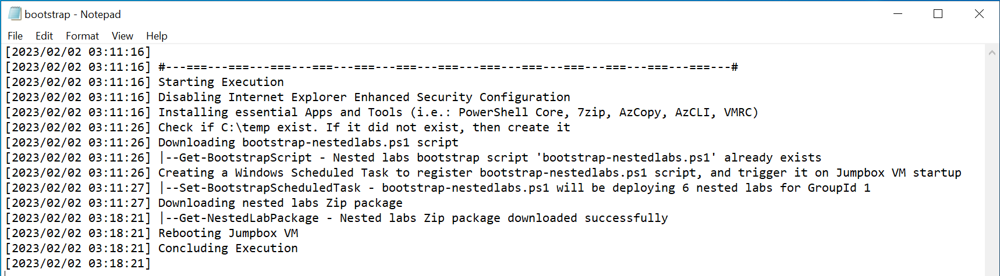
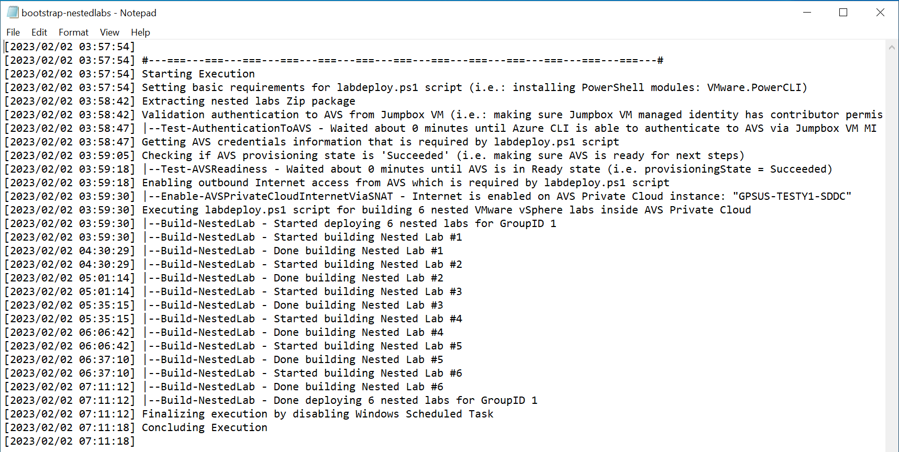
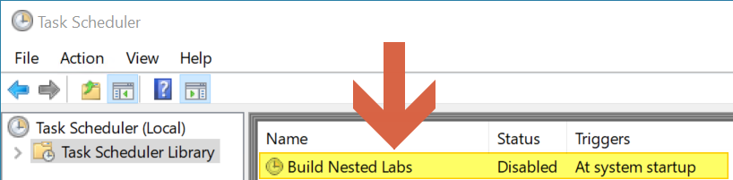
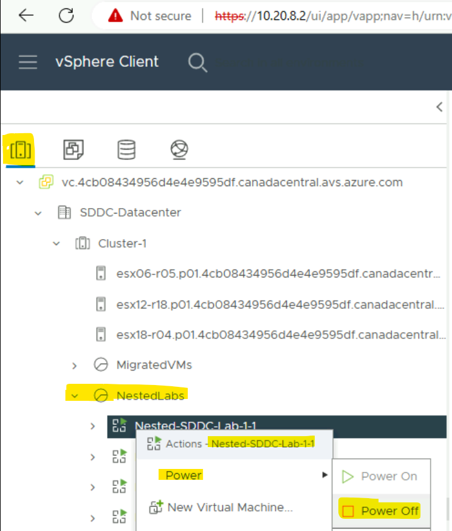
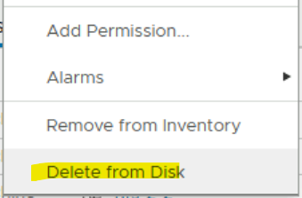
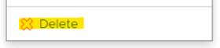

# AVS LAB Automation

This repo has all necessary scripts and artifacts that you need to deploy AVS Lab with nested VMware-based environments.
> [!IMPORTANT]
> Nested virtualization is not supported by neither VMware nor Microsoft. It's used here for the sake of testing certain scenarios in Lab environment.

## Background

Deploying Azure VMware Solution (AVS) in Azure is feasible through multiple mechanisms (Portal/CLI/PowerShell). However, that alone is not enough to practice various exercises to become familiar with the service capabilities. There is a need for an on-premises VMware environment that has connectivity to the AVS private cloud. This, in fact, has been challenging to afford for the purpose of skilling as those resources typically cannot be provisioned on-demand for training or skilling purposes.

To address this issue, AVS Nested Labs has been introduced. It provides organizations and experts with a solution to overcome the challenge of not having an on-premises VMware-based environment. With AVS Nested Labs, you can set up a virtual environment that is similar to on-premises environment, without the need for physical hardware, and still be able to perform your tests and exercises in a safe and isolated environment.

Thus, the solution was to create automation package that will deploy AVS based on Enterprise Scale for Landing Zone templates and run PowerShell scripts that can provision **nested labs** within AVS Private Cloud to server the purpose of on-premises environment.


## Instructions

### Prerequisites

1. Azure CLI: You can download it from [here](https://aka.ms/azurecli).
2. AVS 3-Node Quota available in an Azure Subscription.
3. Permissions, one of the following:
   - Azure RBAC role: **Owner** at Azure Subscription level (scope).
   - Azure RBAC roles: **Contributor** and **User Access Administrator** at Azure Subscription level (scope).
   - Deploy AVS separately, highly recommended through [AVS Accelerator](https://aka.ms/avsenterprisescalerepo), then jump to this [section](#what-if-i-already-have-avs-deployed-can-i-just-provision-the-nested-labs).

### Before you deploy

  1. Decide if you want to deploy a [single](./bicep/ESLZDeploy.Single.LAB.deploy.bicep) AVS Private Cloud (SDDC) , or [multiple](./bicep/ESLZDeploy.LAB.deploy.bicep) AVS Private Clouds.
  2. Review the parameters file, that corresponds to your deployment, to make sure you have the right parameters for the deployment. In other words, this depends if you are just deploying a single AVS Private Cloud (SDDC) or multiple ones.
  3. Based on your choice, you can use the instructions in the section below to kick-off the deployment.

### Deployment

Here are the steps you need to take to deploy AVS Lab with nested VMware lab environments.

1. [Clone](https://docs.github.com/en/repositories/creating-and-managing-repositories/cloning-a-repository) this repository.

   ```powershell
   git clone https://github.com/Azure/avslabs.git
   ```

2. Change directory to 'bicep' directory.

   ```powershell
   cd .\bicep\
   ```

3. Update Parameters File

> [!NOTE]
> Make sure to update the the parameter file with the right values, such as: **NumberOfAVSInstances**, **NumberOfNestedLabsInAVS**, **Prefix**, **Location**, **AlertEmails**, etc...

4. Execute the Deployment

   **From Azure CLI run the deployment command as in the following examples.**

> [!NOTE]
> Make sure to provide the a unique **name** for the deployment, the right **location**, your deployment choice **bicep file** and the corresponding **parameter file**.

   ```azurecli
   az deployment sub create -n "<deployment-unique-name" -l "<location>" -f "<bicep-template-file-name>" -p "<corresponding-parameter-file>" --no-wait

   #An example for **single lab** deployment:
   az deployment sub create -n "AVS-LAB-2023-02-15" -l "brazilsouth" -f "ESLZDeploy.Single.LAB.deploy.bicep" -p "ESLZDeploy.Single.LAB.deploy.bicep.parameters.json" --no-wait

   #An example for **multiple lab** deployment:
   az deployment sub create -n "AVS-LAB-2023-02-15" -l "brazilsouth" -f "ESLZDeploy.LAB.deploy.bicep" -p "ESLZDeploy.LAB.deploy.bicep.parameters.json" --no-wait
   ```

For a reference to *az* deployment command, see [this](https://learn.microsoft.com/en-us/cli/azure/deployment/sub?view=azure-cli-latest#az-deployment-sub-create)

## What if I already have AVS deployed? Can I just provision the nested lab/s?

Yes, you can! 💡

### What you will need?

> [!NOTE]
> You can use Azure Cloud Shell to run the script examples in step #2 and #3.

1) AVS Private Cloud deployed.
2) A deployed Jumpbox VM that can reach out to AVS Private Cloud.

   ```powershell
   #Example
   $jumpboxVMName = "AVSJumpBox"
   $jumpboxVMResourceGroup = "Management-RG"
   az vm identity assign -g $jumpboxVMResourceGroup -n $jumpboxVMName
   # $spID=$(az vm identity assign -g $jumpboxVMResourceGroup -n $jumpboxVMName --query systemAssignedIdentity --out tsv)
   ```

3) System Assigned Managed Identity **enabled on the Jumpbox**.

> [!IMPORTANT]
> Your account need to have Owner role over AVS Private Cloud, or at least User Access Administrator role in order to assign the Jumpbox Managed Identity permission over AVS Private Cloud.

4) **Assign the Jumpbox Managed Identity a Contributor Role over AVS Private Cloud**.

   ```powershell
   #Example:
   
   $jumpboxVMName = "AVSJumpBox"
   $avsPrivateCloudName = "AVS-SDDC"
   
   $spID=$(az resource list -n $jumpboxVMName --query [*].identity.principalId --out tsv)
   $avsPrivateCloudId = $(az resource list -n $avsPrivateCloudName  --query [*].id --out tsv)
   
   if($spID -ne $null) { 
     az role assignment create --assignee $spID --role 'Contributor' --scope $avsPrivateCloudId
   } else {
     Write-Error -Message "The VM does not have System assigned managed identity. Please check previous step!"
   }
   ```

5) At Jumpbox VM, download [bootstrap.ps1](https://raw.githubusercontent.com/Azure/avslabs/main/scripts/bootstrap.ps1) script and store it in **C:\Temp** directory.
   You can run the command below from Command Prompt to download **boostrap.ps1**:

   ```powershell
   powershell.exe -ExecutionPolicy Unrestricted -Command "New-Item -Path C:\ -Name Temp -ItemType Directory -ErrorAction Ignore; Invoke-WebRequest -Uri https://raw.githubusercontent.com/Azure/avslabs/main/scripts/bootstrap.ps1 -OutFile C:\Temp\bootstrap.ps1; Unblock-File -Path C:\Temp\bootstrap.ps1"
   ```

### How to execute? 🧑🏻‍💻

   1) From Jumpbox VM, open Command Prompt (cmd.exe).
   2) Change directory to C:\Temp by running:

      ```powershell
      cd c:\Temp
      ```

   3) Validate that **bootstrap.ps1** exits and the file extension is **.ps1** not .txt for example
   4) Run this command, but first make sure you setup the appropriate **GroupNumber** (keep it 1 if you are not sure), and required number of nested lab environments: **NumberOfNestedLabs**.

> [!NOTE]
> If you are using **Azure Government**, please add **-IsAzureGovernment** switch parameter to the command

   ```powershell
   powershell.exe -ExecutionPolicy Unrestricted -File bootstrap.ps1 -GroupNumber 1 -NumberOfNestedLabs 1 -automated
   ```

   5) **You can track progress** by keeping an eye on `bootstrap.log` and `bootstrap-nestedlabs.log` which will be created in **C:\Temp** directory.

      

      

   6) Note that the Jumpbox VM will be **rebooted** after `bootstrap.ps1` is done executing. A task will be created at Windows Task Scheduler. The task will be triggered at Windows startup, and it will execute `bootstrap-nestedlabs.ps1`. At the end of the execution that Task will be **disabled**. If you want to avoid using the scheduled task method, see [Deploy out of a ScheduledTask context](#deploy-out-of-a-scheduledtask-context) section.

      
      
      


### What is the final result? 🤔

   The final result should be similar to what you see in the screenshot below. Notice the logs path. Also, notice the the nested lab vCenter IP address (i.e., 10.1.1.2), because GroupNumber was set to 1 and NumberOfNestedLabs was set to 1. 

## How to execute without the need for System Assigned Managed Identity?

In case you cannot deploy a System Assigned Managed Identity on the Jumpbox VM used to deploy resources, see the following process:

   1) From Jumpbox VM, open Command Prompt (cmd.exe).
   2) Change directory to C:\Temp by running:

      ```powershell
      cd c:\Temp\
      ```

   3) Create file `C:\Temp\nestedlabs.yml` with the following content and replace the values with the ones matching your environment:

      ```yaml
      AVSvCenter:
         IP: "X.Y.Z.2" # Please enter the URL for AVS vCenter, do not include https:// or any slashes
         Username: "cloudadmin@vsphere.local" # AVS vCenter Username, should be consistent
         Password: "passwordvalue" #Enter the password for the cloudadmin@vsphere.local
      AVSNSXT:
         IP: "X.Y.Z.3" # Please enter the URL for AVS NSX-T Manager, do not include https:// or any slashes
         Username: "cloudadmin" # NSX-T Username from the Azure portal
         Password: "passwordvalue" # #Enter the password for the cloudadmin
      ```

   4) Validate that **bootstrap.ps1** exits and the file extension is **.ps1** not .txt for example

   5) Run this command, but first make sure you setup the appropriate **GroupNumber** (keep it 1 if you are not sure), and required number of nested lab environments: **NumberOfNestedLabs**.

> [!NOTE]
> If you are using **Azure Government**, please add **-IsAzureGovernment** switch parameter to the command

   ```powershell
   powershell.exe -ExecutionPolicy Unrestricted -File bootstrap.ps1 -GroupNumber 1 -NumberOfNestedLabs 1 -automated
   ```

## Troubleshoot

### How to delete nested labs?

You may want to clean nested labs as they could have already consumed and you would like to start from scratch without redeploying AVS Private Cloud, or deploying the nested labs could have failed while you are deploying them, so you need to clean failed labs and start over. Here are the steps to do so:

1) Go to **vCenter** Portal -> **Inventory** view, then find the 'NestedLabs' **Resource Pool**.
2) Right click on the desired nested lab **vApp**. And **Power Off** all VMs that resides inside the **vApp**.

   

3) Delete the nested lab vApp; right-click and choose **Delete from Disk**.

   

4) Delete the Resource Pool 'NestedLabs'.

   

5) Go to NSX-T Portal -> Go to Segments.
6) Delete any segments created for the NestedLabs (i.e.: Group-1-1-**NestedLab**).

### Deploy out of a ScheduledTask context

You can run `bootstrap.ps1` without parameter `-automated` to initiate a deployment that will not use a ScheduleTask nor reboot the Jumpbox.

   ```powershell
   powershell.exe -ExecutionPolicy Unrestricted -File bootstrap.ps1
   ```

You can then Open a PowerShell 7 session to run the deployment script:

   ```powershell
   pwsh.exe -ExecutionPolicy Unrestricted -WorkingDirectory "c:\temp" -File "c:\temp\bootstrap-nestedlabs.ps1" -GroupId X -Labs Y
   ```

### Restart a deployment from a specific lab index

In case of failure during the labs deployment, you can restart the deployment process from a specific lab index by using `bootstrap-nestedlabs.ps1` and parameter `-ReStartIndex X`.

> [!NOTE]
> You will need to use the clean up process from above to remove existing data from the labs you want to retry the creation if some resources where already deployed.

```powershell
# if you need to (re)deploy lab 5 to 6 only:
c:\temp\bootstrap-nestedlabs.ps1 -GroupId X -Labs 6 -ReStartIndex 5
```

## Disclaimer

This is not official Microsoft documentation or software.
This is not an endorsement or a sign-off of an architecture or a design.
This code-sample is provided "AS IT IS" without warranty of any kind, either expressed or implied, including but not limited to the implied warranties of merchantability and/or fitness for a particular purpose.
This sample is not supported under any Microsoft standard support program or service.
Microsoft further disclaims all implied warranties, including, without limitation, any implied warranties of merchantability or fitness for a particular purpose.
The entire risk arising out of the use or performance of the sample and documentation remains with you.
In no event shall Microsoft, its authors, or anyone else involved in the creation, production, or delivery of the script be liable for any damages whatsoever (including, without limitation, damages for loss of business profits, business interruption, loss of business information, or other pecuniary loss) arising out of the use of or inability to use the sample or documentation, even if Microsoft has been advised of the possibility of such damages
